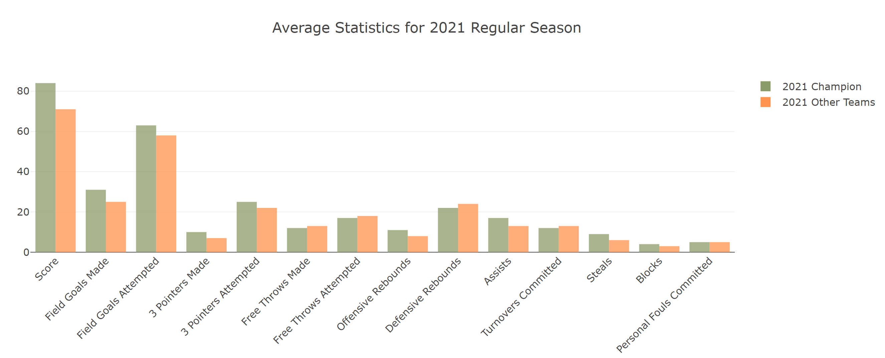
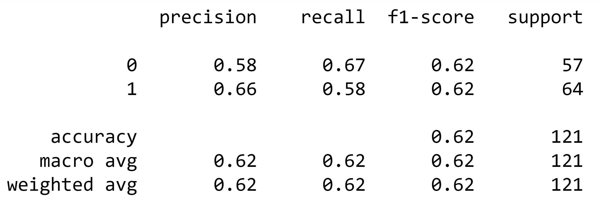
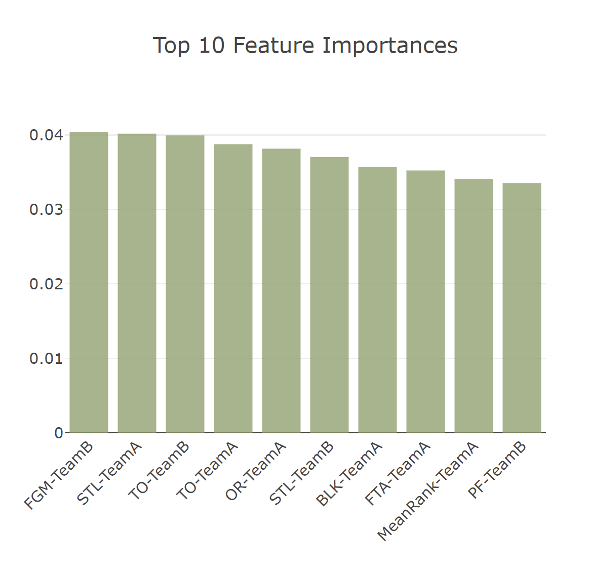

# Machine Madness

## :basketball: Topic
The goal of this project is to use historical NCAA mens' basketball data to train a Machine Learning model. The main questions of interest are:

1. Can Machine Learning be used to accurately predict outcomes of various matchups in the 2022 March Madness Tournament?
2. Which variables lead to the most accurate predictions? 

This topic was chosen for a variety of reasons. First, an immense amount of sports data is generated each day from various schools, events, and leagues. In addition, this data is widely varied in categories. Some may be data about physical characteristics of individual players, and other data may detail team performance. Because of this rise in big data in sports, there are increased efforts to analyze this data in order to provide better sports services to stakeholders such as athletes, coaches, competition-level decision makers, and the general public. In addition, certain types of data can be used by coaches and athletes to customize training and gameplay strategies for better performance. 

In addition to a rise in sports analytics, there has also been a rise in online sports betting. Online sports betting has become a huge business as more states move to legalize sports betting, and more notably, launch an online betting component. Sports betting overall generated 3.16 billion dollars in the first 10 months of 2021, which is a 230% increase from 2020. 

Both sports betting and sports analytics deal heavily in prediction. Both fields may be interested in predicting outcomes of games, predicting player performance, or predicting rising star players. Machine learning is well suited for the task of prediction, as it can take in a large amount of historical data with many features (like sports data) and predict new output values. Because of the growth of both sports analytics and online sports betting, we decided to explore the potential of machine learning in predicting outcomes of sports events. Because the start date of the current project was in March, we thought that focusing our efforts on the 2022 March Madness tournament would be highly relevant. 

## :basketball: Data Source
The data used for this project was found on [Kaggle](https://www.kaggle.com/c/mens-march-mania-2022/data). The data is in multiple CSV files and includes the following information:
- Team Names & ID
- Locations
- Conferences
- Coaches
- Tournament seeds since 1984-85 
- Regular Season Results
- Conference Tournament Results
- NCAA Tournament Results

## :basketball: Process
1. Clean data in CSV files. 
2. Import data into a Database.
3. Combine necessary tables. 
4. Import table into Jupyter Notebook.
5. Process data using a Machine Learning Model.
6. Analyze the results and create visualizations.
7. Create a dashboard and presentation. 

## :basketball: Technologies
Various technologies were used throughout the different stages of this project. 

- Data Processing
    - Python
    - pandas
    - Jupyter Notebook
    - postgreSQL
    - SQLAlchemy
- Analysis
    - NumPy
    - SKLearn
- Dashboard & Presentation
    - HTML
    - CSS
    - JavaScript
    - Bootstrap
    - D3
    - Plotly
    - Google Slides

## :basketball: Database

## :basketball: Model
### Data Exploration and Preprocessing
The data was first checked for missing values, of which there were none. Next, we imported the CSV files into tables created in [SQL](SQL/updated_sql_queries.txt). The first thing we were interested in exploring was if there were any differences in average game statistics for tournament winners compared to the rest of the teams. To do this, the champion of the 2021 NCAA tournament was identified, and the team's statistics for all of the games that the champion team played in the regular season were averaged. The 2021 regular season statistics for all other teams were then combined and averaged. It was found that the champion team had higher average values for 9 of the statistics. We used this information, combined with our teams’ general knowledge of basketball, to pick the initial feature variables of our model.

**2021 Statistics**     

### Model Selection
The data used for the model were regular season game statistics. Because the way in which sports are played is constantly evolving, only data from 2012 and onward was used. This allowed the model to still have a significant amount of data, while also ensuring that the data used was relevant. The goal of the model was to determine whether "Team A" or "Team B" would win in a given matchup based on the teams' previous statistics. 

Our current model is a [random forest classifier](rf_model.ipynb). Classification in random forests employs an ensemble methodology to attain the outcome. It creates many trees on the subset of the data and combines the output of all the trees. The benefit of random forest classifiers is that they reduce overfitting, and they also reduce variance which improves accuracy. A downside of random forest classifiers is the increased computational power needed, as the sklearn algorithm uses 100 trees by default. 

### Analysis
The detailed offensive/defensive statistics were split into winning and losing team statistics. Next, ordinal rankings of the teams were included. The minimum, maximum, and mean rankings were generated for each team in each season. We used an 80/20 split for our training and testing sets, respectively. Based on the classification report (seen below), the model achieved an accuracy of 0.62. After evaluating the accuracy of the model, the top 10 feature importances were calculated based on mean decrease in impurity. The feature with the highest importance was the number of field goals made by Team B. The feature with the second highest importance was the number of steals by Team A. 

**Classification Report**    

**Top Ten Features**     

## :basketball: Dashboard
When first launching the dashboard, the header and navigagtion bar fill the user's screen. To proceed other sections, the user can either scroll or click on the section title in the navbar. 

A demo of the dashboard can be seen in the GIF below:

The navbar is stickied to the top, so even as the user scrolls the navbar remains visible at the top of their screen. This allows the user to easily jump between sections.

The first section of our dashboard includes a background section that gives information on our topic and the purpose of the analysis, as well as the tools used to complete the analysis. Below that, there is a section that describes the data and the data exploration process. Next is a section that includes information about model selection and images from the analysis phase. The last major section is the results section, where the focus is a filterable table. The user is able to filter the predicted game results by typing a team in the search box to the left of the table. The table will filter to display only games in which that team participated. At the bottom of the page there is a small section which lists the team members and includes each user's email and links to each team member’s github profiles. 

HTML was used along with Bootstrap for the general layout, and CSS will was used to style the dashboard. Plotly was used to create the bar charts, and Javascript was used along with D3 to populate the filterable table. 

## :basketball: Presentation
The Google Slides presentation for this project can be found here: [Machine Madness Presentation](https://docs.google.com/presentation/d/1_0r-Ifx1cumsOJh4Ke97PbYVbtlrDqmavh7X7dyavLg/edit?usp=sharing)

## :basketball: Team Information
### Members
- [Rick Cruz](https://github.com/racruz25)
- [Javi Garcia](https://github.com/l-javier-garcia)
- [Ali Herington](https://github.com/alilynnh)
- [Chris Llewellyn](https://github.com/chllrisll)

